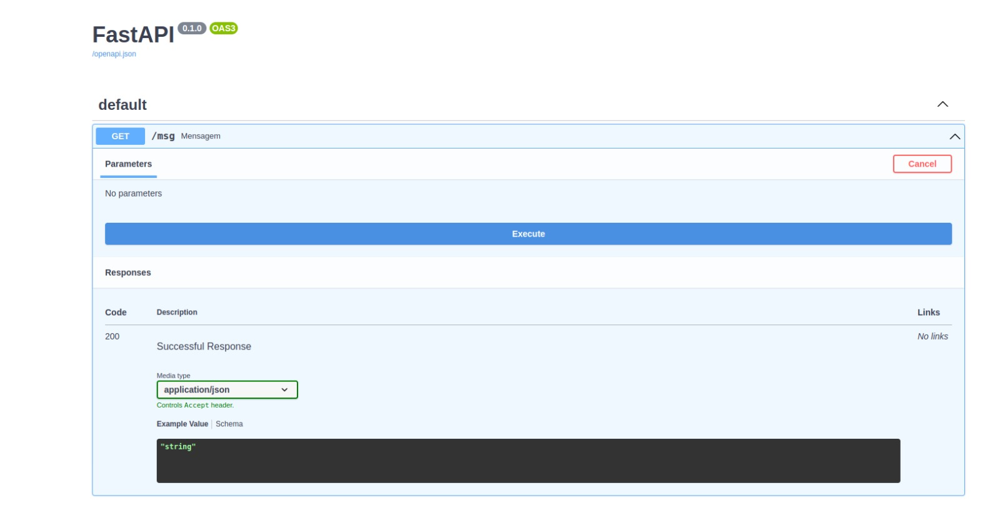
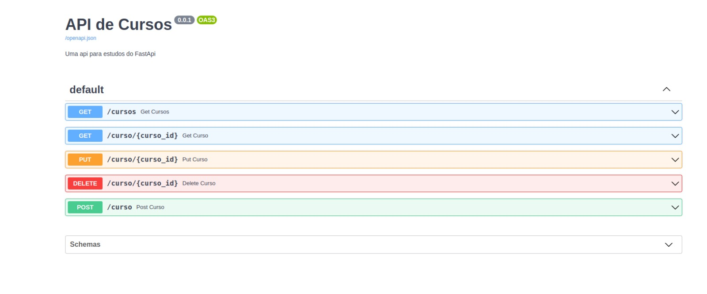
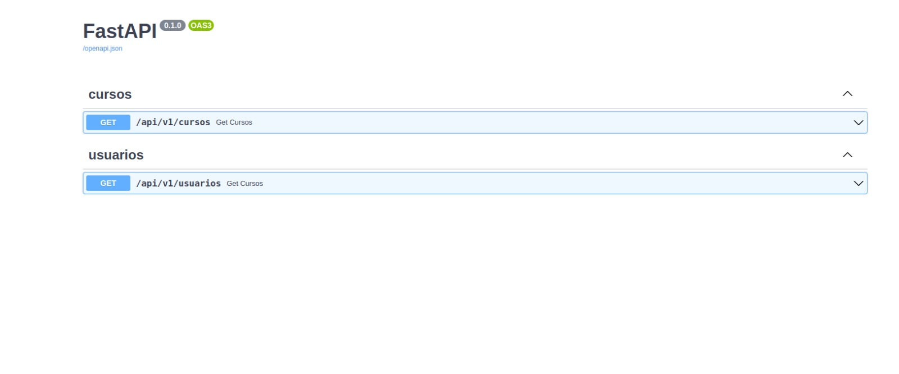
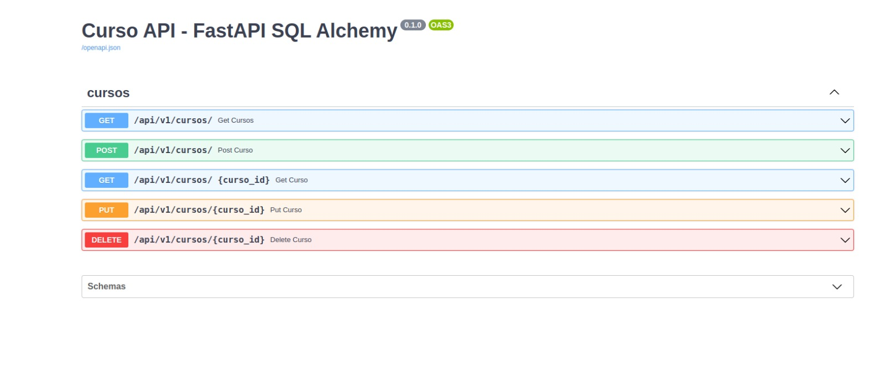

# Estudos sobre o framework FastAPI

Nesse repositório contém projetos realizados com python assíncrono e o framework
FastAPI.

### Pré-requisitos

Em cada seção contém um arquivo "requeriments.txt" onde contém todas as bibliotecas usadas
nos projetos separadamentes.

- Python
- O banco de dados é de sua escolha, mas nesse projeto utilizei o PostgreSQL e a lib sqlalchemy
- Instalação dos requeriments.txt disponibilizados

###  Execução

Basta entrar na pasta do diretório no terminal e rodar pythn main.py

### Alguns Exemplos:

#### Exemplo da seção 02

#### Exemplo da seção 03

#### Exemplo da seção 03 parte 02

#### Exemplo da seção 04

